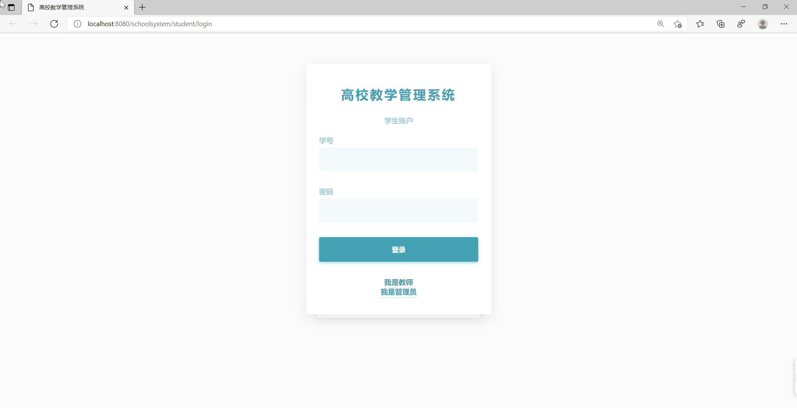
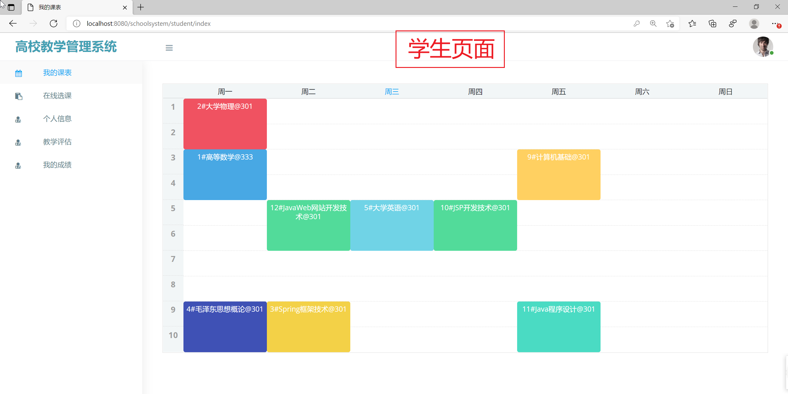
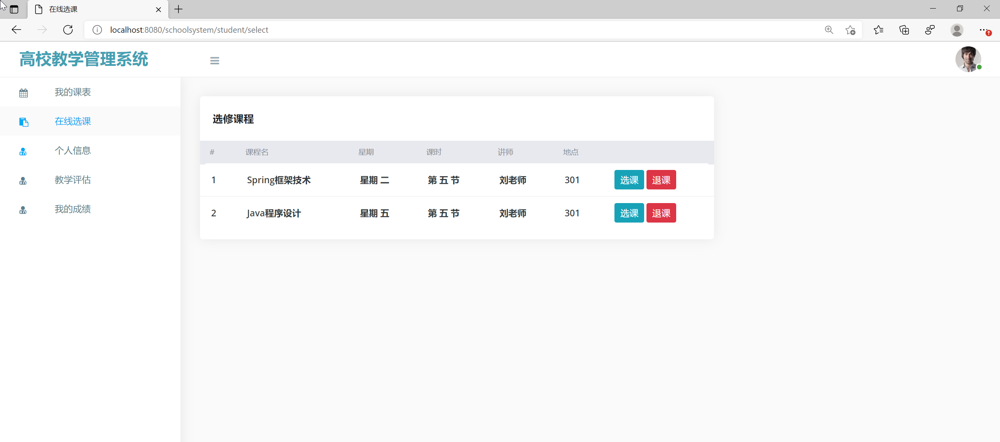
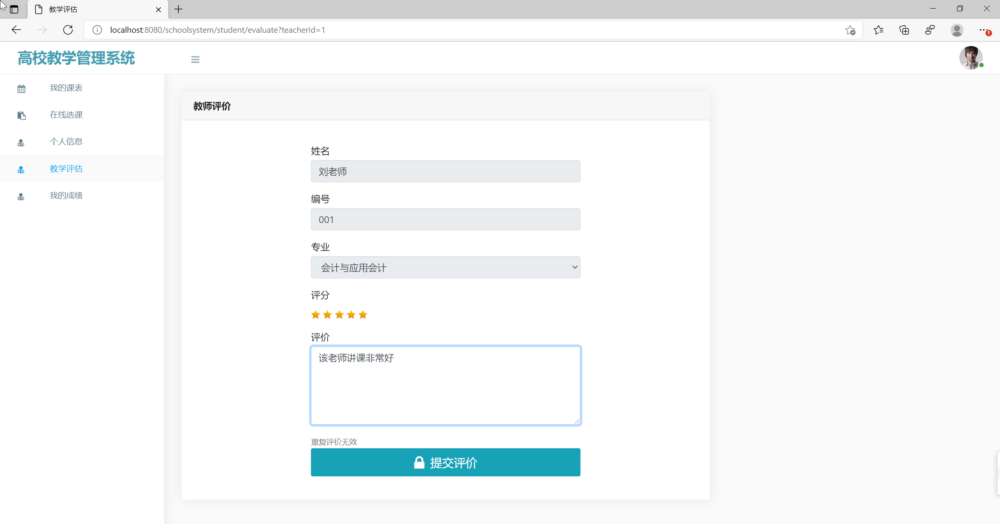
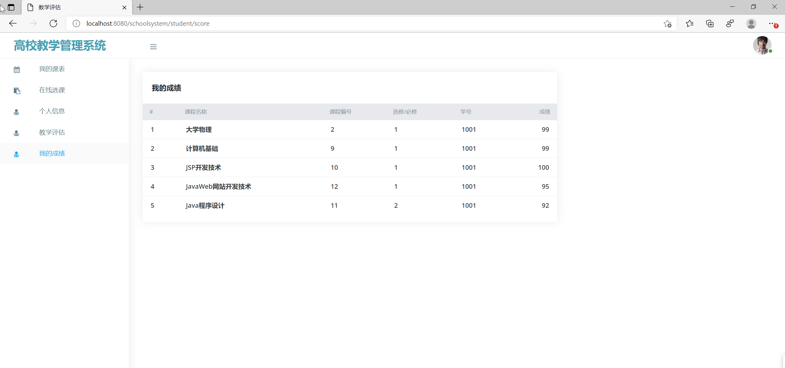
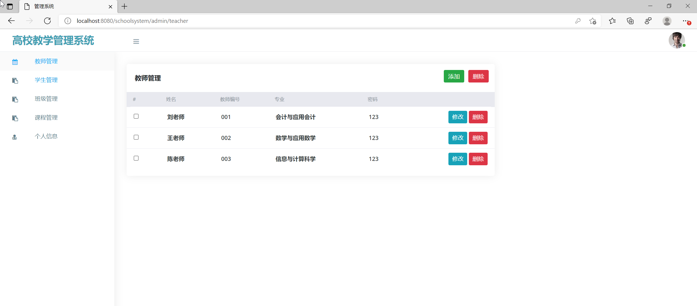
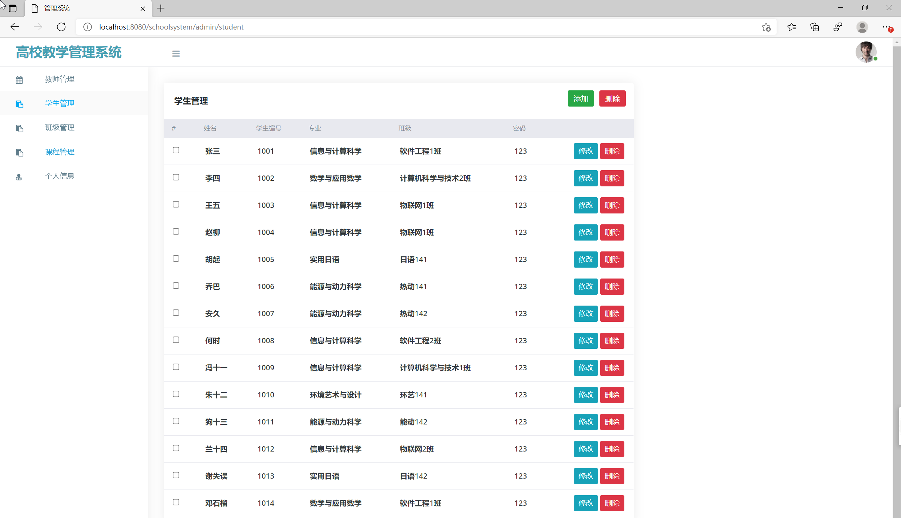

基于SSM的高校教学管理系统
=
### 完整代码获取地址：从戎源码网 ([https://armycodes.com/](https://armycodes.com/))
### 作者微信：19941326836  QQ：952045282 
### 承接计算机毕业设计、Java毕业设计、Python毕业设计、深度学习、机器学习
### 选题+开题报告+任务书+程序定制+安装调试+论文+答辩ppt 一条龙服务
### 所有选题地址https://github.com/nature924/allProject

一、项目介绍
---
基于SSM实现的高校教学管理系统,
本高校教学管理系统分为学生模块、教师模块和管理员模块，分别对应三种角色：学生、教师和管理员。

### 
(一)、学生模块
1.我的课表：学生可以查看自己的课表
2.在线选课：学生可以在线选课或退课
3.个人信息：学生可以修改自己的信息
4.教学评估：学生可以对老师进行评价打分
5.我的成绩：学生可以查看个人成绩信息
###
(二)、教师模块
1.我的课表：教师可以查看自己的课表，对学生的课程成绩进行打分
2.个人信息：教师可以修改自己的信息
3.退出系统：教师可以退出登陆
###
(三)、管理员模块：
1.教师管理：管理员可以对教师信息进行添加、查看、修改或删除
2.学生管理：管理员可以对学生信息进行添加、查看、修改或删除
3.班级管理：管理员可以对班级信息进行添加、查看、修改或删除
4.课程管理：管理员可以对课程信息进行添加、查看、修改或删除
5.个人信息：管理员可以修改自己的信息

二、项目技术
---
- 编程语言：Java
- 数据库：MySQL
- 项目管理工具：Maven
- 前端技术：JSP、HTML、Jquery、Layui、ECharts
- 后端技术：Spring、SpringMVC、MyBatis

三、运行环境
---
- 操作系统：Windows、macOS都可以
- JDK版本：JDK1.8以上都可以
- 开发工具：IDEA、Ecplise、Myecplise都可以
- 数据库: MySQL5.7以上都可以
- Tomcat：任意版本都可以
- Maven：任意版本都可以

四、运行截图
---

### 程序截图：

